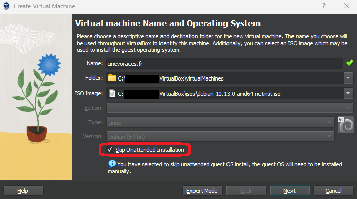

# Production server virtualization

This guide shows you how to configure a **_"cinevoraces.fr"_** production environment in a VM. This will allow you to test your application/infrastructure in a safe and controlled environment.

_Because testing in production is wrong... Don't do that._

#### Current configuration

```
OVH VPS - Monocore
Debian GNU/Linux 10 (buster)
2Go RAM
40Go SSD NVMe
```

#### Sources

-   [Download Debian Buster _(Not needed with VirtualBox)_](https://www.debian.org/releases/buster/debian-installer/)
-   [Download VM tool - VirtualBox](https://www.virtualbox.org/)
-   [Download VM tool - UTM _(Mac only)_](https://mac.getutm.app/)

### Install requirements (VM)

Install the following packages in the debian VM

> -   ssh
> -   firewalld

Check that the ssh service is running and set in the firewall

```bash
firewall-cmd --zone=public --list-services
```

Add it to your firewall if it's not listed

```bash
firewall-cmd --zone=public --add-service=ssh --permanent
firewall-cmd --reload
```

### Guided installation (VirtualBox 7.0)

#### Create the VM

Create a new VM **manually** in order to skip graphical interface installation and set SSH as a required dependency.

_Refer to Current configuration section for the VM configuration._



#### Set SSH port

Once your Debian VM is installed, open your VM Settings and select the **"Network"** menu.

-   Select an adapter and set it to **"NAT"**
-   Click on **"Advanced"** then **"Port Forwarding"**
-   Add a new rule where:
    -   **Name** => Whatever name you want
    -   **Protocol** => **"TCP"** _(as it's what ssh uses)_
    -   **Host IP** => Best to leave blank
        -   _(use `ip a` in your VM to get it if you want to set it manually)_
    -   **Host Port** => Whatever port you wish to use
    -   **Guest IP** => Best to leave blank
        -   _(use `ip a` in your VM to get it if you want to set it manually)_
    -   **Guest Port** => VM SSH port _(default to 22)_

#### Connect from your host

```bash
ssh -p <my_ssh_port> <username>@<my_vm_ip_address>
```

That should look like something like that

```bash
ssh -p 8090 debian@127.0.0.1
```
